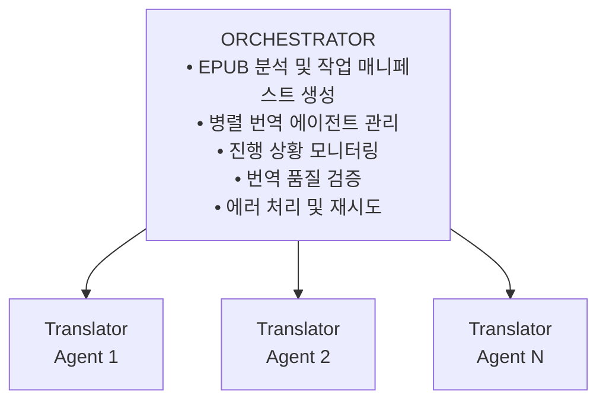

# EPUB 번역 스킬 (epub-translator)

[English](README.md)

EPUB 전자책 파일을 다양한 언어 간에 번역하는 Claude Code Agent Skill입니다.

## 특징

- **다국어 지원**: 일본어, 영어, 중국어 등 다양한 언어에서 한국어(또는 다른 언어)로 번역
- **병렬 처리**: 여러 권의 책을 동시에, 대용량 파일은 분할하여 병렬 번역
- **구조 보존**: EPUB 포맷과 스타일을 그대로 유지
- **커스텀 사전**: 캐릭터 이름, 고유 용어 등의 일관된 번역 지원
- **2단계 품질 검증**: 원문 잔존 검사 + 번역 품질(번역투) 자동 검사
- **설정 가능한 분할**: 파일 분할 임계값과 분할 개수를 사용자가 조절 가능

## 설치

### 요구사항

- Python 3.8 이상
- `zip`, `unzip` 명령어
- (선택) `epubcheck` - EPUB 유효성 검사

### Claude Code에 스킬 추가

1. 이 저장소를 클론하거나 다운로드합니다:
2. Claude Code 설정에서 스킬 디렉토리를 등록합니다:
   ```bash
   # ~/.claude/settings.json 또는 프로젝트의 .claude/settings.local.json
   {
     "skills": [
       "/path/to/epub-translator"
     ]
   }
   ```
3. Claude Code를 재시작하면 스킬이 활성화됩니다.

## 사용법

### 기본 사용

```bash
# 일본어 소설을 한국어로 번역 (기본값)
/epub-translator "/books/novel.epub"

# 영어 소설을 한국어로 번역
/epub-translator "/books/english_novel.epub" --source-lang en

# 여러 EPUB 파일 일괄 번역
/epub-translator "/books/" --parallel 10
```

### 고급 사용

```bash
# 분할 임계값 조정 (더 큰 파일도 분할하지 않음)
/epub-translator "/books/novel.epub" --split-threshold 50

# 더 보수적인 분할 (작은 파일도 분할, 더 많은 조각으로)
/epub-translator "/books/large.epub" --split-threshold 20 --split-parts 6

# 일본어를 영어로 번역
/epub-translator "/books/jp_novel.epub" --source-lang ja --target-lang en
```

### 옵션

| 옵션 | 설명 | 기본값 |
|------|------|--------|
| `--source-lang` | 원본 언어 코드 | `ja` |
| `--target-lang` | 번역 대상 언어 코드 | `ko` |
| `--dict` | 커스텀 사전 파일 (JSON) | 없음 |
| `--output-dir` | 출력 디렉토리 | `./translated` |
| `--parallel` | 동시 번역 에이전트 수 | `5` |
| `--split-threshold` | 파일 분할 임계값 (KB) | `30` |
| `--split-parts` | 대형 파일 분할 개수 | `4` |
| `--high-quality` | Opus 모델로 고품질 번역 | `false` |

### 파일 분할 설정 가이드

| 상황 | 권장 설정 |
|------|----------|
| 기본 (보수적) | `--split-threshold 30` |
| 느린 연결 / 타임아웃 발생 | `--split-threshold 20 --split-parts 6` |
| 빠른 연결 / 대용량 처리 | `--split-threshold 50 --split-parts 3` |

### 언어 코드

| 코드 | 언어 |
|------|------|
| `ja` | 일본어 |
| `en` | 영어 |
| `ko` | 한국어 |
| `zh` | 중국어 |
| `es` | 스페인어 |
| `fr` | 프랑스어 |
| `de` | 독일어 |

그 외 ISO 639-1 언어 코드 사용 가능

## 품질 검증

### 2단계 검증 시스템

1. **원문 잔존 검사** (`verify.py`)
   - 번역 후 원본 언어 문자가 남아있는지 확인
   - 일본어: 히라가나, 가타카나, 한자 검사

2. **LLM 기반 번역 품질 검증**
   - 정규식이 아닌 LLM 서브에이전트를 활용한 맥락 인식 검증
   - 자연스러움, 문체, 번역투 감지
   - 토큰 효율적인 텍스트 추출 및 병렬 검증

### 검증 프로세스

1. `extract_for_validation.py`로 번역된 텍스트를 토큰 효율적으로 추출
2. 청크별로 검증 에이전트 병렬 실행
3. 결과 집계 및 품질 점수 산출

### 검증 지침 파일

| 대상 언어 | 지침 파일 |
|-----------|-----------|
| 한국어 | `validator_ko.md` (한국어 특화) |
| 기타 | `validator_generic.md` (범용) |

### 품질 점수 기준

| 점수 | 평가 |
|------|------|
| 90-100 | 우수 - 자연스러운 번역 |
| 75-89 | 양호 - 경미한 문제 |
| 60-74 | 보통 - 검토 권장 |
| 60 미만 | 미흡 - 재번역 필요 |

### 한국어 특화 검증 항목

- **번역투 패턴**: `~하는 것이다`, `~라고 하는`, `~하지 않으면 안 된다`
- **대명사 과다 사용**: `그녀는`, `그는`, `그것은`
- **조사 체인**: `의의의` 반복
- **존댓말 일관성**: 캐릭터 관계에 맞는 어체 사용

## 커스텀 사전 (선택 사항)

문서 전체에서 일관된 번역이 필요한 **고유명사**와 **문서 특유의 용어**에만 사전을 사용합니다.

### 사전 형식

```json
{
  "metadata": {
    "source_language": "ja",
    "target_language": "ko",
    "document_title": "문서 제목"
  },
  "proper_nouns": {
    "names": {
      "田中太郎": "다나카 타로"
    },
    "organizations": {
      "株式会社ABC": "ABC 주식회사"
    }
  },
  "domain_terms": {
    "独自技術名": "고유 기술명"
  }
}
```

### 사전 템플릿

- `assets/template.json` - 범용 사전 템플릿
- `assets/template_academic.json` - 학술/기술 문서용 템플릿

**중요**:
- 번역기는 문맥에 따라 자연스럽게 번역합니다
- 사전은 **고유명사**(인명, 지명, 조직명)와 **문서 고유 용어**에만 사용하세요
- 일반 단어(마법, 왕국, 기술 등)는 **절대** 사전에 추가하지 마세요

## 아키텍처



### 워크플로우

1. **분석 단계**: EPUB 압축 해제, 파일 구조 분석, 대용량 파일 분할
2. **번역 단계**: 병렬 에이전트로 파일/섹션 번역
3. **메타데이터 번역**: 목차(toc.ncx, nav.xhtml), 책 정보(content.opf), 표지 번역
4. **검증 단계**: 원문 잔존 검사
5. **품질 검증 단계**: LLM 기반 번역 품질 평가
6. **마무리 단계**: 분할 파일 병합, 스타일 조정, EPUB 패키징

## 디렉토리 구조

```
epub-translator/
├── SKILL.md              # 스킬 정의 (Agent Skills 표준)
├── README.md             # 영어 문서
├── README.ko-KR.md       # 한국어 문서 (이 파일)
├── references/           # 상세 지침서
│   ├── orchestrator.md   # Orchestrator 지침
│   ├── translator_ja.md  # 일본어 번역기 프롬프트
│   ├── translator_en.md  # 영어 번역기 프롬프트
│   ├── translator_generic.md  # 범용 번역기 프롬프트
│   ├── translator_metadata.md # 메타데이터/목차 번역 지침
│   ├── layout_conversion.md   # 레이아웃 변환 가이드
│   ├── validator_generic.md   # 범용 검증 지침
│   └── validator_ko.md   # 한국어 특화 검증 지침
├── scripts/              # 실행 스크립트
│   ├── analyze_epub.py   # EPUB 분석 (분할 설정 가능)
│   ├── split_xhtml.py    # 파일 분할
│   ├── merge_xhtml.py    # 파일 병합
│   ├── verify.py         # 원문 잔존 검사
│   ├── extract_for_validation.py  # LLM 검증용 텍스트 추출
│   └── package_epub.sh   # EPUB 패키징
└── assets/               # 리소스 파일
    ├── common_ja_ko.json # 일한 사전
    ├── common_en_ko.json # 영한 사전
    ├── template.json     # 사전 템플릿
    └── manifest.json     # 매니페스트 템플릿
```

## 언어별 특수 처리

### 소스 언어별 처리

#### 일본어 (ja)
- 루비 태그(후리가나) 제거
- 세로쓰기(縦書き) 처리
- 일본어 문장부호 변환 (「」→"", 。→.)

#### 중국어 (zh)
- 번체/간체 처리
- 병음 주석 제거

#### 아랍어/히브리어 (ar/he)
- RTL 텍스트 방향 처리
- 양방향 텍스트 처리

### 레이아웃 변환 (타겟 언어 기준)

**핵심 원칙**: 모든 언어는 기본적으로 가로쓰기(horizontal LTR)를 사용합니다. (RTL 언어 제외)

| 타겟 언어 | 페이지 방향 | 쓰기 모드 | 비고 |
|-----------|-------------|-----------|------|
| 한국어 (ko) | ltr | horizontal-tb | |
| 영어 (en) | ltr | horizontal-tb | |
| 일본어 (ja) | ltr | horizontal-tb | 기본값 |
| 중국어 (zh) | ltr | horizontal-tb | 기본값 |
| 아랍어 (ar) | rtl | horizontal-tb | |
| 히브리어 (he) | rtl | horizontal-tb | |

**참고**: 일본어/중국어 세로쓰기는 `--vertical` 옵션 필요

자세한 변환 스크립트는 `references/layout_conversion.md` 참조

## 문제 해결

### 번역 후 원문이 남아있는 경우

```bash
# 검증 스크립트 실행
python3 scripts/verify.py --work-dir /tmp/epub_translate_xxx --source-lang ja
```

### 번역 품질이 낮은 경우

```bash
# 품질 검증 스크립트 실행
python3 scripts/validate_quality.py --dir /tmp/epub_translate_xxx/translated --target-lang ko -v
```

### XML 오류 발생 시

꺾쇠괄호 문제일 수 있습니다. `<한글>` → `〈한글〉`로 변환이 필요합니다.

### 대용량 파일 타임아웃

```bash
# 더 작게 분할
/epub-translator "/books/large.epub" --split-threshold 20 --split-parts 6
```

