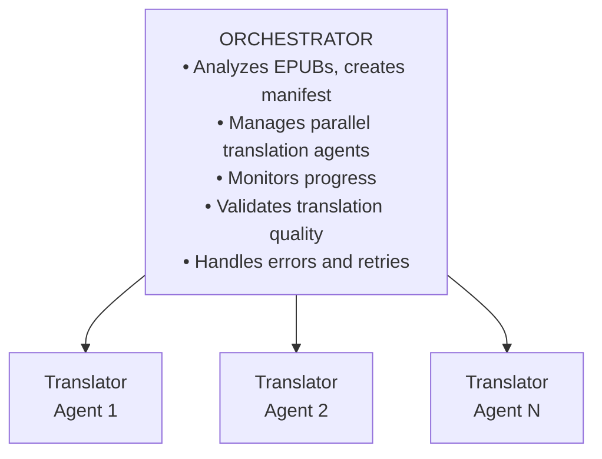

# EPUB Translation Skill (epub-translator)

[한국어](README.ko-KR.md)

A Claude Code Agent Skill for translating EPUB ebook files between languages.

## Features

- **Multi-language Support**: Translate from Japanese, English, Chinese, and more to Korean (or any target language)
- **Parallel Processing**: Translate multiple books simultaneously, split large files for parallel translation
- **Structure Preservation**: Maintains EPUB format and styling
- **Custom Dictionaries**: Consistent translation of character names and terminology
- **LLM-Based Quality Validation**: Context-aware quality assessment using sub-agents
- **Configurable Splitting**: Adjustable file split thresholds and part counts

## Installation

### Requirements

- Python 3.8+
- `zip`, `unzip` commands
- (Optional) `epubcheck` - EPUB validation

### Adding to Claude Code

1. Clone or download this repository:
2. Register the skill directory in Claude Code settings:
   ```bash
   # ~/.claude/settings.json or project's .claude/settings.local.json
   {
     "skills": [
       "/path/to/epub-translator"
     ]
   }
   ```
3. Restart Claude Code to activate the skill.

## Usage

### Basic Usage

```bash
# Translate Japanese novel to Korean (default)
/epub-translator "/books/novel.epub"

# Translate English novel to Korean
/epub-translator "/books/english_novel.epub" --source-lang en

# Batch translate multiple EPUB files
/epub-translator "/books/" --parallel 10

# Translate to a different target language
/epub-translator "/books/novel.epub" --source-lang ja --target-lang en
```

### Advanced Usage

```bash
# Adjust split threshold (less splitting for larger files)
/epub-translator "/books/novel.epub" --split-threshold 50

# More conservative splitting (smaller files, more parts)
/epub-translator "/books/large.epub" --split-threshold 20 --split-parts 6

# Japanese to English translation
/epub-translator "/books/jp_novel.epub" --source-lang ja --target-lang en
```

### Options

| Option | Description | Default |
|--------|-------------|---------|
| `--source-lang` | Source language code | `ja` |
| `--target-lang` | Target language code | `ko` |
| `--dict` | Custom dictionary file (JSON) | none |
| `--output-dir` | Output directory | `./translated` |
| `--parallel` | Number of concurrent agents | `5` |
| `--split-threshold` | File split threshold (KB) | `30` |
| `--split-parts` | Number of parts for large files | `4` |
| `--high-quality` | Use Opus model for higher quality | `false` |

### File Splitting Configuration

| Situation | Recommended Settings |
|-----------|---------------------|
| Default (conservative) | `--split-threshold 30` |
| Slow connection / Timeouts | `--split-threshold 20 --split-parts 6` |
| Fast connection / Large context | `--split-threshold 50 --split-parts 3` |

### Language Codes

| Code | Language |
|------|----------|
| `ja` | Japanese |
| `en` | English |
| `ko` | Korean |
| `zh` | Chinese |
| `es` | Spanish |
| `fr` | French |
| `de` | German |

Any ISO 639-1 language code is supported.

## Quality Validation

### Two-Stage Verification System

1. **Source Text Verification** (`verify.py`)
   - Checks if original language characters remain after translation
   - Japanese: Checks hiragana, katakana, kanji

2. **LLM-Based Translation Quality Validation**
   - Context-aware validation using LLM sub-agents (not regex patterns)
   - Assesses naturalness, style, and translationese detection
   - Token-efficient text extraction with parallel validation

### Validation Process

1. Extract translated text token-efficiently with `extract_for_validation.py`
2. Run validation agents in parallel for each chunk
3. Aggregate results and calculate quality score

### Validator Instruction Files

| Target Language | Instruction File |
|-----------------|------------------|
| Korean | `validator_ko.md` (Korean-specific) |
| Other | `validator_generic.md` (Generic) |

### Quality Score Criteria

| Score | Assessment |
|-------|------------|
| 90-100 | Excellent - reads naturally |
| 75-89 | Good - minor issues |
| 60-74 | Acceptable - review recommended |
| Below 60 | Poor - re-translation needed |

### Korean-Specific Validation Items

- **Translationese patterns**: `~하는 것이다`, `~라고 하는`, `~하지 않으면 안 된다`
- **Pronoun overuse**: `그녀는`, `그는`, `그것은`
- **Particle chains**: Repeated `의의의`
- **Honorific consistency**: Appropriate speech levels for character relationships

## Custom Dictionary (Optional)

Use dictionaries only for **proper nouns** and **document-specific terms** that require consistent translation throughout the document.

### Dictionary Format

```json
{
  "metadata": {
    "source_language": "ja",
    "target_language": "ko",
    "document_title": "Document Title"
  },
  "proper_nouns": {
    "names": {
      "田中太郎": "Tanaka Taro"
    },
    "organizations": {
      "株式会社ABC": "ABC Corporation"
    }
  },
  "domain_terms": {
    "独自技術名": "Proprietary Technology Name"
  }
}
```

### Dictionary Templates

- `assets/template.json` - General-purpose dictionary template
- `assets/template_academic.json` - Academic/technical document template

**Important**:
- The translator naturally translates based on context
- Use dictionaries ONLY for **proper nouns** (names, places, organizations) and **document-specific terms**
- **NEVER** add common words (magic, kingdom, technology, etc.) to dictionaries

## Architecture



### Workflow

1. **Analysis Phase**: Extract EPUB, analyze structure, split large files
2. **Translation Phase**: Parallel translation of files/sections
3. **Metadata Translation**: Translate TOC (toc.ncx, nav.xhtml), book info (content.opf), cover pages
4. **Verification Phase**: Check for remaining source text
5. **Quality Validation Phase**: LLM-based naturalness assessment
6. **Finalization Phase**: Merge splits, apply style adjustments, package EPUB

## Directory Structure

```
epub-translator/
├── SKILL.md              # Skill definition (Agent Skills standard)
├── README.md             # English documentation (this file)
├── README.ko-KR.md       # Korean documentation
├── references/           # Detailed instructions
│   ├── orchestrator.md   # Orchestrator instructions
│   ├── translator_ja.md  # Japanese translator prompt
│   ├── translator_en.md  # English translator prompt
│   ├── translator_generic.md  # Generic translator prompt
│   ├── translator_metadata.md # Metadata and TOC translation instruction
│   ├── layout_conversion.md   # Layout conversion guide
│   ├── validator_generic.md   # Generic validation instruction
│   └── validator_ko.md   # Korean-specific validation instruction
├── scripts/              # Executable scripts
│   ├── analyze_epub.py   # EPUB analysis (configurable splitting)
│   ├── split_xhtml.py    # File splitting
│   ├── merge_xhtml.py    # File merging
│   ├── verify.py         # Source text verification
│   ├── extract_for_validation.py  # Text extraction for LLM validation
│   └── package_epub.sh   # EPUB packaging
└── assets/               # Resource files
    ├── common_ja_ko.json # JA-KO dictionary
    ├── common_en_ko.json # EN-KO dictionary
    ├── template.json     # Dictionary template
    └── manifest.json     # Manifest template
```

## Language-Specific Processing

### Source Language Handling

#### Japanese (ja)
- Remove ruby tags (furigana)
- Handle vertical writing (縦書き)
- Convert Japanese punctuation (「」→"", 。→.)

#### Chinese (zh)
- Handle traditional/simplified variants
- Remove pinyin annotations

#### Arabic/Hebrew (ar/he)
- Handle RTL text direction
- Bidirectional text handling

### Layout Conversion (Target-Based)

**Key Principle**: All languages default to horizontal LTR (except RTL languages).

| Target Language | Page Direction | Writing Mode | Notes |
|-----------------|----------------|--------------|-------|
| Korean (ko) | ltr | horizontal-tb | |
| English (en) | ltr | horizontal-tb | |
| Japanese (ja) | ltr | horizontal-tb | Default |
| Chinese (zh) | ltr | horizontal-tb | Default |
| Arabic (ar) | rtl | horizontal-tb | |
| Hebrew (he) | rtl | horizontal-tb | |

**Note**: Japanese/Chinese vertical writing requires explicit `--vertical` flag.

See `references/layout_conversion.md` for complete conversion scripts.

## Troubleshooting

### Source text remaining after translation

```bash
# Run verification script
python3 scripts/verify.py --work-dir /tmp/epub_translate_xxx --source-lang ja
```

### Low translation quality

```bash
# Extract text for validation review
python3 scripts/extract_for_validation.py --dir /tmp/epub_translate_xxx/translated --output-dir /tmp/validation --single-file
```

### XML errors

May be caused by angle brackets. `<Korean text>` needs to be converted to `〈Korean text〉`.

### Large file timeout

```bash
# Use smaller split threshold
/epub-translator "/books/large.epub" --split-threshold 20 --split-parts 6
```

