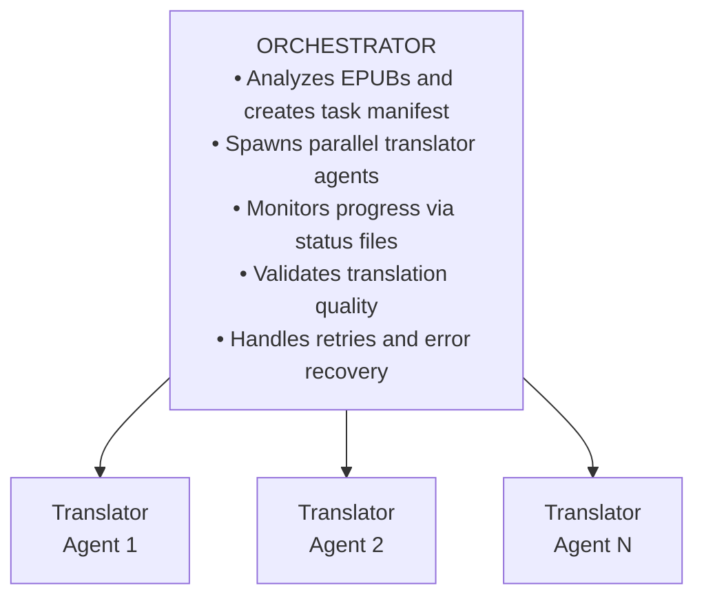

# EPUB Translation Skill

Translate EPUB files between any language pair with optimized support for Japanese and English to Korean.

## When to Use This Skill

Use this skill when:
- User wants to translate an EPUB ebook to another language
- User mentions translating Japanese/English/Chinese novels or books
- User has multiple EPUB files to translate in batch
- User needs to preserve EPUB formatting and structure during translation

## Usage

```bash
/epub-translator <epub_path> [options]
```

### Arguments
- `<epub_path>`: EPUB file or directory containing EPUBs

### Options
| Option | Description | Default |
|--------|-------------|---------|
| `--source-lang` | Source language code | `ja` |
| `--target-lang` | Target language code | `ko` |
| `--dict` | Custom dictionary (JSON) | none |
| `--output-dir` | Output directory | `./translated` |
| `--parallel` | Concurrent agents | `5` |
| `--split-threshold` | File size for splitting (KB) | `30` |
| `--split-parts` | Parts to split large files | `4` |
| `--high-quality` | Use Opus model for translation | `false` |

### Language Codes
`ja` (Japanese), `en` (English), `ko` (Korean), `zh` (Chinese), `es` (Spanish), `fr` (French), `de` (German), `ru` (Russian), `ar` (Arabic), or any ISO 639-1 code.

## Examples

```bash
# Japanese novel to Korean (default)
/epub-translator "/books/novel.epub"

# English to Korean
/epub-translator "/books/english.epub" --source-lang en

# Japanese to English
/epub-translator "/books/jp_novel.epub" --source-lang ja --target-lang en

# High-quality translation using Opus model
/epub-translator "/books/important.epub" --high-quality

# Batch with larger split threshold (less splitting)
/epub-translator "/books/" --split-threshold 50 --parallel 10

# More aggressive splitting for slower connections
/epub-translator "/books/large.epub" --split-threshold 20 --split-parts 6
```

---

## Architecture



**Key Constraint**: Sub-agents do NOT have Task tool access. They use only Read, Edit, Write, and Bash.

---

## Model Selection

### Default (no flags)
| Task | Model |
|------|-------|
| Content translation | Sonnet |
| Metadata/TOC | Haiku |
| Validation | Haiku |

### With `--high-quality`
| Task | Model |
|------|-------|
| Content translation | Opus |
| Metadata/TOC | Sonnet |
| Validation | Sonnet |

### Automatic Upgrade
- If quality score < 70: Re-translate flagged files with Opus
- If translation fails: Retry with upgraded model

---

## Execution Workflow

### Phase 1: Analysis

1. Create work directory:
   ```bash
   WORK_DIR="/tmp/epub_translate_$(date +%s)"
   mkdir -p "$WORK_DIR"/{extracted,sections,translated,status,logs}
   ```

2. Analyze EPUBs (with configurable split threshold):
   ```bash
   python3 scripts/analyze_epub.py \
     --epub "{EPUB_PATH}" \
     --work-dir "$WORK_DIR" \
     --source-lang "{SOURCE_LANG}" \
     --target-lang "{TARGET_LANG}" \
     --split-threshold 30 \
     --split-parts 4
   ```

3. Review `$WORK_DIR/manifest.json` for task count.

### Phase 2: Translation

1. Select translator prompt from [references/](references/):
   - Japanese: `translator_ja.md`
   - English: `translator_en.md`
   - Other: `translator_generic.md`

2. Spawn Task agents with:
   - `run_in_background: true`
   - `model: "sonnet"`
   - **CRITICAL**: Multiple Tasks in single message for true parallelism

3. Monitor progress:
   ```bash
   find "$WORK_DIR/status" -name "*.status" -exec grep -l "completed" {} \; | wc -l
   ```

4. Retry failed tasks (max 2 attempts, upgrade to `opus` if persistent)

### Phase 3: Finalization

1. Merge split files:
   ```bash
   python3 scripts/merge_xhtml.py --work-dir "$WORK_DIR" --manifest manifest.json
   ```

2. Translate metadata and navigation (LLM-based):
   - Spawn metadata translation agent using `translator_metadata.md`
   - Translate: toc.ncx, nav.xhtml, content.opf (title, author, description)
   - Translate: cover.xhtml, titlepage.xhtml (if present)
   - Ensure TOC entries match translated chapter headings

3. Apply technical adjustments (stylesheet.css, page direction)

4. Verify source text removed:
   ```bash
   python3 scripts/verify.py --work-dir "$WORK_DIR" --source-lang "{SOURCE_LANG}"
   ```

### Phase 4: Quality Validation (LLM-Based)

1. Extract text for validation (token-efficient format):
   ```bash
   python3 scripts/extract_for_validation.py \
     --dir "$WORK_DIR/translated" \
     --output-dir "$WORK_DIR/validation" \
     --max-tokens 8000
   ```

2. Select validator prompt from [references/](references/):
   - Korean target: `validator_ko.md` (extends `validator_generic.md`)
   - Other targets: `validator_generic.md`

3. Spawn validation Task agents:
   - Read `$WORK_DIR/validation/validation_manifest.json`
   - For each chunk, spawn a validator agent with:
     - `run_in_background: true`
     - `model: "haiku"` (sufficient for validation)
   - **CRITICAL**: Multiple Tasks in single message for parallelism

4. Monitor validation progress:
   ```bash
   find "$WORK_DIR/validation" -name "*.status" -exec grep -l "completed" {} \; | wc -l
   ```

5. Aggregate results:
   - Collect all `*_result.json` files
   - Calculate average quality score
   - Identify files flagged for re-translation

6. **If average score < 70**: Re-translate flagged files with `model: "opus"`

### Phase 5: Packaging

1. Package EPUB:
   ```bash
   bash scripts/package_epub.sh "$WORK_DIR" "{OUTPUT_DIR}"
   ```

2. Generate final report with quality metrics

---

## File Splitting Configuration

Conservative defaults prevent context overflow in translation agents:

| Setting | Default | Description |
|---------|---------|-------------|
| `split-threshold` | 30 KB | Files larger than this are split |
| `split-parts` | 4 | Number of sections per large file |

### Tuning Guidelines

- **Slow connection / Timeouts**: Lower threshold (20 KB), more parts (6)
- **Fast connection / Large context**: Higher threshold (50 KB), fewer parts (3)
- **Very large files (100KB+)**: Will be split into more parts automatically

---

## Quality Validation (LLM-Based)

Translation quality is validated by LLM sub-agents, not regex patterns. This provides:
- Context-aware naturalness assessment
- Understanding of literary style and tone
- Detection of subtle translation issues

### Validator Instructions

| Target Language | Primary Instruction | Base Instruction |
|-----------------|---------------------|------------------|
| Korean | `validator_ko.md` | `validator_generic.md` |
| Other | `validator_generic.md` | - |

### Korean-Specific Checks
- **Translationese (번역투)**: `~하는 것이다`, `~라고 하는`, etc.
- **Pronoun overuse**: Excessive `그녀는`, `그는`
- **Particle chains**: Awkward `의의의` patterns
- **Honorific consistency**: Speech level matching

### Quality Score
- 90-100: Excellent - reads naturally
- 75-89: Good - minor issues
- 60-74: Acceptable - review recommended
- <60: Poor - re-translation needed

### Validation Workflow
1. Text extracted in token-efficient format
2. Chunked for parallel validation (8000 tokens each)
3. LLM validators assess each chunk
4. Results aggregated into final report

---

## Language-Specific Processing

### Source Language Handling

| Source | Special Handling |
|--------|------------------|
| Japanese | Remove ruby tags, handle vertical writing |
| Chinese | Handle traditional/simplified, remove pinyin |
| Arabic/Hebrew | Handle RTL text direction |
| English | Standard processing |

### Layout Conversion (Target-Based)

**Key Principle**: All languages default to horizontal LTR (except RTL languages).

| Target Language | Page Direction | Writing Mode | Text Direction | Notes |
|-----------------|----------------|--------------|----------------|-------|
| Korean (ko) | ltr | horizontal-tb | ltr | |
| English (en) | ltr | horizontal-tb | ltr | |
| Japanese (ja) | ltr | horizontal-tb | ltr | Default |
| Chinese (zh) | ltr | horizontal-tb | ltr | Default |
| Arabic (ar) | rtl | horizontal-tb | rtl | |
| Hebrew (he) | rtl | horizontal-tb | rtl | |

**Note**: Japanese/Chinese vertical writing requires explicit `--vertical` flag.

See `references/layout_conversion.md` for complete conversion scripts.

---

## Custom Dictionary (Optional)

**The translator works without external dictionary files.** It naturally translates based on context.

Use custom dictionaries ONLY for:
- **Proper nouns**: names, places, organizations, brands
- **Document-specific terms**: proprietary terms unique to this document

**Do NOT add common words** - let the translator handle them naturally.

### Creating a Custom Dictionary

See [assets/template.json](assets/template.json) for format:

```json
{
  "proper_nouns": { "names": { "田中太郎": "Tanaka Taro" } },
  "domain_terms": { "ProprietaryTech": "고유 기술명" }
}
```

### Academic/Technical Template

For academic or technical documents, use [assets/template_academic.json](assets/template_academic.json).

---

## Work Directory Structure

```
$WORK_DIR/
├── manifest.json           # Task manifest
├── extracted/              # Extracted EPUB contents
├── sections/               # Split large files
├── translated/             # Translated files
├── validation/             # Validation input/output files
│   ├── validation_manifest.json
│   ├── validate_001_input.txt
│   ├── validate_001_result.json
│   └── ...
├── status/                 # Task status files
└── logs/                   # Log files
```

## Status Codes

| Status | Meaning |
|--------|---------|
| `pending` | Not started |
| `in_progress` | Being translated |
| `completed` | Done |
| `failed` | Error occurred |

---

## Error Handling

| Error | Action |
|-------|--------|
| Extraction failure | Skip corrupted file |
| Translation timeout | Split further, retry |
| XML error | Attempt fix, report |
| Remaining source text | Re-translate or manual review |
| Low quality score | Review samples, re-translate if needed |

---

## File Reference

| Path | Description |
|------|-------------|
| `SKILL.md` | This file |
| `references/orchestrator.md` | Detailed orchestrator instructions |
| `references/translator_*.md` | Language-specific translator prompts |
| `references/translator_metadata.md` | Metadata and TOC translation instruction |
| `references/layout_conversion.md` | Writing direction and layout conversion guide |
| `references/validator_generic.md` | Generic validation instruction |
| `references/validator_ko.md` | Korean-specific validation instruction |
| `scripts/analyze_epub.py` | EPUB analysis (configurable splitting) |
| `scripts/split_xhtml.py` | File splitting |
| `scripts/merge_xhtml.py` | Section merging |
| `scripts/verify.py` | Source text verification |
| `scripts/extract_for_validation.py` | Token-efficient text extraction for LLM validation |
| `scripts/package_epub.sh` | EPUB packaging |
| `assets/template.json` | Dictionary template |
| `assets/template_academic.json` | Academic dictionary template |
