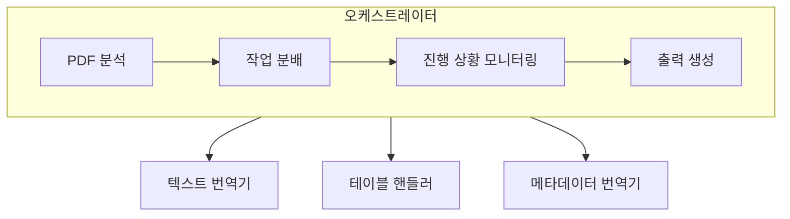

# PDF 번역 스킬

PDF 문서를 다양한 언어로 번역하고 Markdown 및 PDF 형식으로 출력하는 Claude Code 스킬입니다.

[English](README.md)

## 주요 기능

- 다국어 번역 지원 (일본어, 영어, 중국어, 한국어 등)
- 소스 언어 자동 감지
- 테이블 및 메타데이터 추출/번역
- 학술 모드 (원문 용어 병기)
- 사용자 정의 사전 지원
- 서브 에이전트를 통한 병렬 처리
- 출력 형식: Markdown, PDF

## 요구 사항

- Claude Code CLI
- Python 3.8+

### 환경 설정

스킬이 자동으로 의존성을 설정합니다. 처음 사용 전 한 번 실행하세요:

```bash
bash scripts/setup_env.sh
```

이 스크립트는:
- `uv`가 있으면 사용 (더 빠름)
- 없으면 `python venv + pip` 사용
- `.venv/`에 필요한 패키지 설치 (pymupdf, pdfplumber, reportlab)

## 빠른 시작

### 기본 사용법

```bash
# 일본어 PDF를 한국어로 번역
/pdf-translator path/to/document.pdf --to ko

# 소스 언어 자동 감지
/pdf-translator document.pdf --to en

# 학술 모드 (원문 용어 병기)
/pdf-translator paper.pdf --to ko --academic
```

### 사용자 정의 사전 (선택 사항)

**번역기는 외부 사전 없이도 작동합니다.** 사전은 다음 경우에만 사용하세요:
- **고유 명사**: 인명, 지명, 조직명
- **문서 고유 용어**: 해당 문서에만 있는 특수 용어

일반적인 단어는 추가하지 마세요 - 번역기가 문맥에 맞게 자연스럽게 처리합니다.

```json
{
  "metadata": {
    "source_language": "en",
    "target_language": "ko"
  },
  "proper_nouns": {
    "names": { "John Smith": "존 스미스" },
    "organizations": { "OpenAI": "OpenAI" }
  },
  "domain_terms": {
    "ProprietaryTech": "고유 기술명"
  },
  "preserve_original": {
    "terms": ["API", "GPU", "URL"]
  }
}
```

```bash
/pdf-translator document.pdf --to ko --dict my-dictionary.json
```

일반 문서는 [assets/template.json](assets/template.json), 학술 문서는 [assets/template_academic.json](assets/template_academic.json)을 참조하세요.

## 출력 옵션

| 옵션 | 설명 |
|------|------|
| `--output markdown` | Markdown만 출력 (기본값) |
| `--output pdf` | PDF만 출력 |
| `--output both` | 두 형식 모두 출력 |

## 아키텍처



## 작업 디렉토리 구조

```
work_dir/
├── manifest.json        # 작업 매니페스트
├── extracted/           # 추출된 원본 콘텐츠 (JSON)
├── translated/          # 번역된 콘텐츠 (JSON)
├── status/              # 작업 상태 파일
├── images/              # 추출된 이미지
├── validation/          # 품질 검증
└── output/              # 최종 출력 파일
```

## 스크립트

| 스크립트 | 설명 |
|----------|------|
| `analyze_pdf.py` | PDF 분석 및 매니페스트 생성 |
| `merge_to_markdown.py` | Markdown 출력 생성 |
| `generate_pdf.py` | PDF 출력 생성 |
| `verify.py` | 번역 검증 |
| `extract_for_validation.py` | LLM 검증용 텍스트 추출 |

## 번역 품질

2단계 번역 프로세스를 사용합니다:

1. **직역 단계**: 원문의 의미를 정확하게 파악
2. **다듬기 단계**: 목표 언어에서 자연스러운 표현으로 변환

품질 검증 항목:
- 소스 언어 잔존 문자 확인
- 자연스러운 표현 (번역투 제거)
- 용어 일관성

## 지원 언어

| 코드 | 언어 |
|------|------|
| `ja` | 일본어 |
| `en` | 영어 |
| `ko` | 한국어 |
| `zh` | 중국어 |
| `ar` | 아랍어 |
| `ru` | 러시아어 |

## 라이선스

MIT
