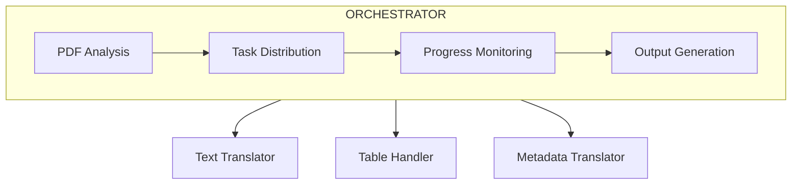

# PDF Translate Skill

A Claude Code skill for translating PDF documents into multiple languages with high-quality output in Markdown and PDF formats.

[한국어](README.ko-KR.md)

## Features

- Multi-language translation (Japanese, English, Chinese, Korean, etc.)
- Automatic source language detection
- Table and metadata extraction/translation
- Academic mode with term annotations
- Custom dictionary support
- Parallel processing with sub-agents
- Output formats: Markdown, PDF

## Requirements

- Claude Code CLI
- Python 3.8+

### Environment Setup

The skill automatically sets up dependencies. Run once before first use:

```bash
bash scripts/setup_env.sh
```

This script:
- Uses `uv` if available (faster)
- Falls back to `python venv + pip` otherwise
- Creates `.venv/` with all required packages (pymupdf, pdfplumber, reportlab)

## Quick Start

### Basic Usage

```bash
# Translate Japanese PDF to Korean
/pdf path/to/document.pdf --to ko

# Auto-detect source language
/pdf document.pdf --to en

# Academic mode (includes original terms)
/pdf paper.pdf --to ko --academic
```

### Custom Dictionary (Optional)

**The translator works without external dictionaries.** Use dictionaries only for:
- **Proper nouns**: names, places, organizations
- **Document-specific terms**: proprietary terms unique to your document

Do NOT add common words - let the translator handle them naturally.

```json
{
  "metadata": {
    "source_language": "en",
    "target_language": "ko"
  },
  "proper_nouns": {
    "names": { "John Smith": "존 스미스" },
    "organizations": { "OpenAI": "OpenAI" }
  },
  "domain_terms": {
    "ProprietaryTech": "고유 기술명"
  },
  "preserve_original": {
    "terms": ["API", "GPU", "URL"]
  }
}
```

```bash
/pdf document.pdf --to ko --dict my-dictionary.json
```

See [assets/template.json](assets/template.json) for general documents or [assets/template_academic.json](assets/template_academic.json) for academic papers.

## Output Options

| Option | Description |
|--------|-------------|
| `--output markdown` | Markdown only (default) |
| `--output pdf` | PDF only |
| `--output both` | Both formats |

## Architecture



## Work Directory Structure

```
work_dir/
├── manifest.json        # Task manifest
├── extracted/           # Source content (JSON)
├── translated/          # Translated content (JSON)
├── status/              # Task status files
├── images/              # Extracted images
├── validation/          # Quality validation
└── output/              # Final output files
```

## Scripts

| Script | Description |
|--------|-------------|
| `analyze_pdf.py` | PDF analysis and manifest generation |
| `merge_to_markdown.py` | Markdown output generation |
| `generate_pdf.py` | PDF output generation |
| `verify.py` | Translation verification |
| `extract_for_validation.py` | Text extraction for LLM validation |

## Translation Quality

The skill uses a two-stage translation process:

1. **Direct Translation**: Accurate meaning capture
2. **Polishing**: Natural target language expression

Quality validation checks:
- Remaining source language characters
- Natural phrasing (no translationese)
- Terminology consistency

## Supported Languages

| Code | Language |
|------|----------|
| `ja` | Japanese |
| `en` | English |
| `ko` | Korean |
| `zh` | Chinese |
| `ar` | Arabic |
| `ru` | Russian |

## License

MIT
