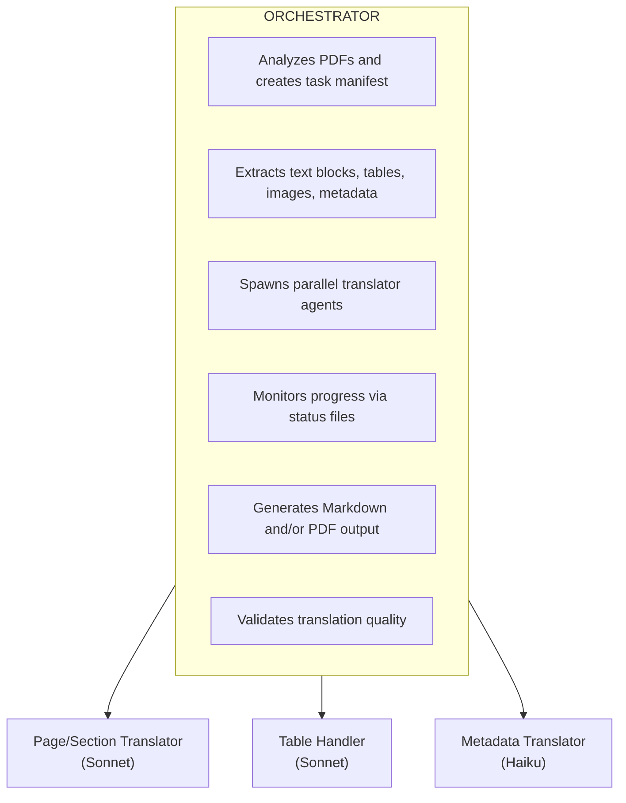

# PDF Translation Skill

Translate PDF documents between any language pair with optimized support for academic papers and documents with complex layouts.

## When to Use This Skill

Use this skill when:
- User wants to translate a PDF document to another language
- User has academic papers, research documents, or technical manuals to translate
- User needs to preserve document structure (tables, headings, lists) during translation
- User wants both Markdown and PDF output formats
- User mentions translating documents with tables, figures, or complex layouts

## Usage

```bash
/pdf-translator <pdf_path> [options]
```

### Arguments
- `<pdf_path>`: PDF file or directory containing PDFs

### Options
| Option | Description | Default |
|--------|-------------|---------|
| `--source-lang` | Source language code (auto for detection) | `auto` |
| `--target-lang` | Target language code | `ko` |
| `--output-format` | Output format (markdown/pdf/both) | `both` |
| `--output-dir` | Output directory | `./translated` |
| `--parallel` | Concurrent agents | `5` |
| `--dict` | Custom dictionary (JSON) | none |
| `--high-quality` | Use Opus model for translation | `false` |
| `--academic` | Academic document mode | `false` |
| `--term-style` | Term annotation style (parenthesis/footnote/inline) | `parenthesis` |
| `--first-occurrence` | Annotate terms only on first occurrence | `true` |
| `--describe-images` | Add AI-generated image descriptions | `false` |

### Language Codes
`ja` (Japanese), `en` (English), `ko` (Korean), `zh` (Chinese), `es` (Spanish), `fr` (French), `de` (German), `ru` (Russian), `ar` (Arabic), `he` (Hebrew), or any ISO 639-1 code.

## Examples

```bash
# Basic translation (English PDF to Korean)
/pdf-translator "/docs/manual.pdf"

# Japanese academic paper to Korean with terminology annotations
/pdf-translator "/papers/research.pdf" --source-lang ja --academic

# High-quality translation using Opus model
/pdf-translator "/papers/important.pdf" --high-quality

# Academic mode with footnote-style term annotations
/pdf-translator "/papers/thesis.pdf" --academic --term-style footnote

# Batch translation of a directory
/pdf-translator "/docs/" --target-lang ko --parallel 10

# Markdown output only
/pdf-translator "/books/novel.pdf" --output-format markdown

# Arabic RTL document to English
/pdf-translator "/docs/arabic.pdf" --source-lang ar --target-lang en
```

---

## Architecture



**Key Constraint**: Sub-agents do NOT have Task tool access. They use only Read, Edit, Write, and Bash.

---

## Execution Workflow

### Phase 0: Environment Setup

**Run once before first use.** The setup script automatically detects and uses `uv` if available, otherwise falls back to `python venv + pip`.

```bash
bash scripts/setup_env.sh
```

This creates a virtual environment at `.venv/` with all required dependencies (pymupdf, pdfplumber, reportlab).

After setup, use the virtual environment's Python:
```bash
PYTHON=".venv/bin/python"
```

### Phase 1: Analysis

1. Create work directory:
   ```bash
   WORK_DIR="/tmp/pdf_translate_$(date +%s)"
   mkdir -p "$WORK_DIR"/{extracted,tables,images,translated,status,logs,output}
   ```

2. Analyze PDF:
   ```bash
   $PYTHON scripts/analyze_pdf.py \
     --pdf "{PDF_PATH}" \
     --work-dir "$WORK_DIR" \
     --source-lang "{SOURCE_LANG}" \
     --target-lang "{TARGET_LANG}" \
     --academic {true/false}
   ```

3. Review `$WORK_DIR/manifest.json` for task count and structure.

### Phase 2: Translation

1. Select translator prompt from [references/](references/):
   - Japanese source: `translator_ja.md`
   - English source: `translator_en.md`
   - Academic mode: `translator_academic.md` (extends base)
   - Other: `translator_generic.md`

2. Spawn Task agents with:
   - `run_in_background: true`
   - `model: "sonnet"` (or `"opus"` if `--high-quality`)
   - **CRITICAL**: Multiple Tasks in single message for true parallelism

3. Monitor progress:
   ```bash
   find "$WORK_DIR/status" -name "*.status" -exec grep -l "completed" {} \; | wc -l
   ```

4. Retry failed tasks (max 2 attempts)

### Phase 3: Output Generation

1. Generate Markdown:
   ```bash
   $PYTHON scripts/merge_to_markdown.py \
     --work-dir "$WORK_DIR" \
     --manifest manifest.json \
     --output "$OUTPUT_DIR/{filename}.md"
   ```

2. Generate PDF (if requested):
   ```bash
   $PYTHON scripts/generate_pdf.py \
     --work-dir "$WORK_DIR" \
     --manifest manifest.json \
     --source-pdf "{ORIGINAL_PDF}" \
     --output "$OUTPUT_DIR/{filename}_translated.pdf"
   ```

### Phase 4: Quality Validation

1. Extract text for validation:
   ```bash
   $PYTHON scripts/extract_for_validation.py \
     --dir "$WORK_DIR/translated" \
     --output-dir "$WORK_DIR/validation" \
     --max-tokens 8000
   ```

2. Spawn validation Task agents (model: haiku)

3. Aggregate results and generate report

---

## Model Selection

### Default (no flags)
| Task | Model |
|------|-------|
| Text translation | Sonnet |
| Table translation | Sonnet |
| Metadata/TOC | Haiku |
| Validation | Haiku |

### With `--high-quality`
| Task | Model |
|------|-------|
| Text translation | Opus |
| Table translation | Opus |
| Metadata/TOC | Sonnet |
| Validation | Sonnet |

---

## Academic Mode (`--academic`)

When enabled:
- Technical terms include original language in parentheses
- Abbreviations expanded on first occurrence
- Citations and references preserved
- Formal academic writing style maintained

### Term Annotation Styles (`--term-style`)

| Style | Example |
|-------|---------|
| `parenthesis` | 기계 학습(Machine Learning) |
| `footnote` | 기계 학습¹ |
| `inline` | 기계 학습/Machine Learning |

### First Occurrence (`--first-occurrence`)

When `true` (default):
- First mention: 기계 학습(Machine Learning)
- Subsequent: 기계 학습

When `false`:
- All mentions include original term

---

## Language-Specific Processing

| Source | Special Handling |
|--------|------------------|
| Japanese | Vertical→horizontal writing, ruby tag removal |
| Chinese | Traditional/simplified handling, vertical→horizontal |
| Arabic/Hebrew | RTL→LTR conversion, text direction adjustment |
| English | Standard processing |

| Target | Special Handling |
|--------|------------------|
| Korean | Translationese removal, natural expression check |

---

## Custom Dictionary (Optional)

**The translator works without external dictionary files.** It naturally translates based on context.

Use custom dictionaries ONLY for:
- **Proper nouns**: names, places, organizations, brands
- **Document-specific terms**: proprietary terms unique to this document

**Do NOT add common words** - let the translator handle them naturally.

### Creating a Custom Dictionary

Use the `--dict` option with a JSON file:

```json
{
  "metadata": {
    "source_language": "en",
    "target_language": "ko",
    "document_title": "Annual Report 2024"
  },
  "proper_nouns": {
    "names": { "John Smith": "존 스미스" },
    "places": { "Silicon Valley": "실리콘밸리" },
    "organizations": { "OpenAI": "OpenAI" }
  },
  "domain_terms": {
    "ProprietaryTech": "고유 기술명"
  },
  "preserve_original": {
    "terms": ["API", "GPU", "URL"]
  },
  "abbreviations": {
    "LLM": "Large Language Model"
  },
  "style_notes": {
    "notes": ""
  }
}
```

### Templates

| Template | Use Case |
|----------|----------|
| [assets/template.json](assets/template.json) | General documents |
| [assets/template_academic.json](assets/template_academic.json) | Academic papers, technical documents |

---

## Work Directory Structure

```
$WORK_DIR/
├── manifest.json           # Task manifest
├── extracted/              # Extracted text blocks by page
│   ├── page_001.json
│   ├── page_002.json
│   └── ...
├── tables/                 # Extracted tables
│   ├── table_001.json
│   └── ...
├── images/                 # Extracted images
├── translated/             # Translated content
│   ├── page_001.json
│   ├── table_001.json
│   └── ...
├── validation/             # Validation files
├── status/                 # Task status files
├── logs/                   # Log files
└── output/                 # Final output files
```

## Status Codes

| Status | Meaning |
|--------|---------|
| `pending` | Not started |
| `in_progress` | Being translated |
| `completed` | Done |
| `failed` | Error occurred |

---

## Error Handling

| Error | Action |
|-------|--------|
| PDF extraction failure | Skip corrupted file, report |
| Translation timeout | Retry with smaller chunks |
| Table extraction failure | Treat as text block |
| Layout preservation failure | Fallback to Markdown only |
| Low quality score | Re-translate with Opus |

---

## Output Formats

### Markdown Output
- Preserves document structure (headings, paragraphs, lists)
- Tables converted to Markdown tables
- Images referenced with paths
- Metadata at document header

### PDF Output
- Attempts to preserve original layout
- Handles text direction changes (RTL→LTR, vertical→horizontal)
- Maintains page structure where possible
- Embedded fonts for target language

---

## File Reference

| Path | Description |
|------|-------------|
| `SKILL.md` | This file |
| `references/orchestrator.md` | Detailed orchestrator instructions |
| `references/translator_*.md` | Language-specific translator prompts |
| `references/translator_academic.md` | Academic document translation |
| `references/table_handler.md` | Table translation instructions |
| `references/metadata_handler.md` | Metadata/TOC translation |
| `references/validator_generic.md` | Generic validation instruction |
| `references/validator_ko.md` | Korean-specific validation |
| `scripts/setup_env.sh` | Environment setup (auto-detects uv or pip) |
| `scripts/analyze_pdf.py` | PDF analysis, layout detection, table extraction, manifest generation |
| `scripts/merge_to_markdown.py` | Markdown output generation |
| `scripts/generate_pdf.py` | PDF output generation |
| `scripts/verify.py` | Translation verification |
| `scripts/extract_for_validation.py` | Token-efficient text extraction for LLM validation |
| `assets/template.json` | Dictionary template for general documents |
| `assets/template_academic.json` | Dictionary template for academic documents |
